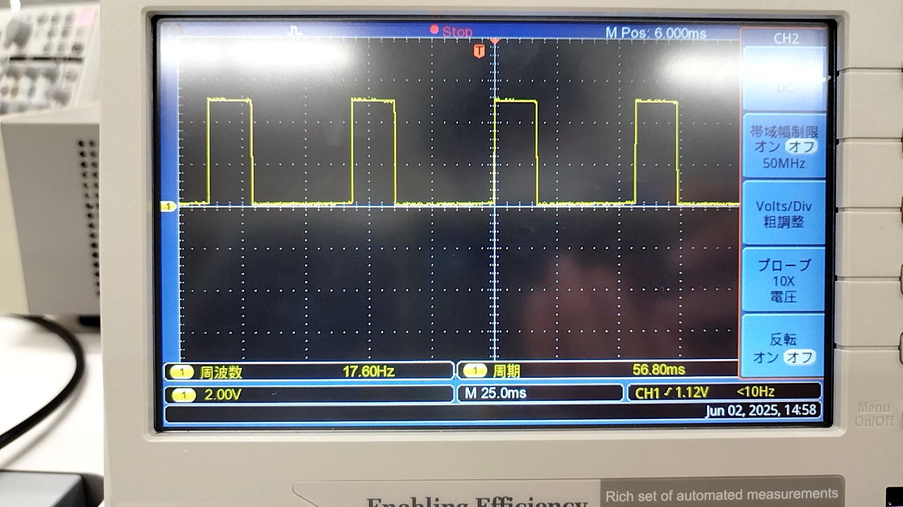

# モータ制御実装
## 1. GPIOとは
>"General-purpose input/output"の略で、「汎用入出力」を意味する(Wikipediaより)

I/Oポートのうち，デジタル信号に関するピンのことで，ユーザ側で任意に制御可能なもののこと．
RaspberryPiでは，以下の図のように40piが割り当てられている．<br>
(https://iot.keicode.com/raspberry-pi/pinout.phpより)
<br>
注意すべき点は，3.3Vや5Vの電源が割り当てられたピン，GNDが割り当てられたピンなど，特別な役割を持ったピンには，ユーザ側で入出力を制御できない．
また，I2CやSPI，UARTといった通信を行う際には，その機能を有したピンを選択する必要がある．

## 2. PWM制御とは
### Ⅰ.
モータに乾電池をつないぐとモータが動作し，回転しだすだろう．では，より早くモータを回すにはどうすればよいか．乾電池を直列につなげばよいだろう．すなわち，電圧が高くなればモータの回転も速くなる．<br>
このように，任意の電圧の変化で信号を表すものをアナログ信号という．しかし，RaspberryPiには，アナログ信号を出力する機能がない．<nr>
RaspberryPiは，デジタル信号のみをサポートするから，パルスのONとOFFのみで，モータの速さを制御しなければならない．<br>
そこで，今回実装するモータ制御では，PWM制御というものを利用する．ここでは，PWM制御について学ぶ．<br>
PWM制御とは，強弱をパルスの幅で伝えることで，平均の電圧を調整することにより，モータなどを制御する技術のことをいう．<br>
ここで大切となるのが，PWM波形である．では，実際に波形を見てみよう．

PWM波形はパルス波形の一種である．0と1の2値しか存在しない．例えば，図のような波形の場合，1となるのは周期に対して約40%である．一方，0となるのは周期に対して約60%である．
よって，仮に電圧が5Vかかっていた場合，理論的には5Vの40%である，2VがPWM波形によって与えられることとなる．<br>
このように，PWM波形ではパルスが1となる割合を変化させることで，平均の電力を操作している．<br>
PWM制御において重要な概念に**Duty比**がある．これは，1周期に対してパルスが，どの程度1となるかを示すものである．例えば，図においては，パルスは40%の時間，1となっているから，Duty比は40となる．

今回は，図のような波形をモータに出力することにより，モータ制御を実現する．

### Ⅱ.とりあえずRaspberryPiから信号を出してみよう
RaspberryPiとブレッドボード，LEDと抵抗を準備する．RaspberryPiのGPIO26番を出力とし，抵抗，LED，RaspberryPiのGNDの順に直列で接続する．<br>
RaspberryPiに`example\01_motor_control\signal.py`をコピーし，これを実行する．LEDが5秒間，点灯すれば成功である．<br><br>
ここからは，プログラムの解説を行う．
```py
import RPi.GPIO as GPIO
```
RPi.GPIOはRaspberryPiが標準で持つライブラリである．その名の通り，RaspberryPiのGPIOの入出力制御を手軽に行える優れものである．<br>
```py
GPIO.setmode(GPIO.BCM)
```
これは，ピン番号の指定の仕方を明示するものである．RaspberryPiのGPIOのピンしていでは，二通りの方法がある．1つは，GPIO〇〇番という指定の仕方，もう1つが，1~40まで順番に割り振られたものである．一般的には，前者の**GPIO〇〇番**という指定を行う．
```py
GPIO.setup(LED,GPIO.OUT)
```
ここで，実際に何番のピンを入出力どちらで使用するかを設定している．今回は，出力のため`GPIO.OUT`を引数に与えている．<br>
以上で，GPIO26番から信号を出力する用意ができる．なお，`time.sleep(5)`は5秒間，出力させ続けるために使用している．
<br>
忘れてはいけないのが，
```py
GPIO.cleanup()
```
である．これを実行することによって，ピンが解放される．

### Ⅲ.PWM波形を出力しよう
`example\01_motor_control\pwm.py`をRaspberryPiにコピーし，実行する．LEDが点灯すれば成功．(Tips:さっきと比べてLEDの光はどうなっている？)

以下にプログラムの解説を行う．<br>
最初は先ほどのプログラムと同様である．
```py
pwm = GPIO.PWM(pwm,10)
```
ここで，PWM波を出力するように設定している．引数の`10`は，パルスの周波数を表している．この値を変化させて，LEDの光の変化を見てみよう．
```py
pwm.start(40)
```
これによって，PWM波が出力される．引数の`40`はduty比を示している．今回の場合は，Duty比40%である．

#### 課題
+α：任意の周波数，duty比でPWM波を出力できるプログラムを作ろう．波形をLEDとオシロスコープで見てみよう．

## 3. モータ制御プログラムの実装
今までのサンプルプログラムと`example\01_motor_control\motor.py`を参考にして，もたー制御のプログラムを実装する．<br>
モータドライバのマニュアルを参考にすること．